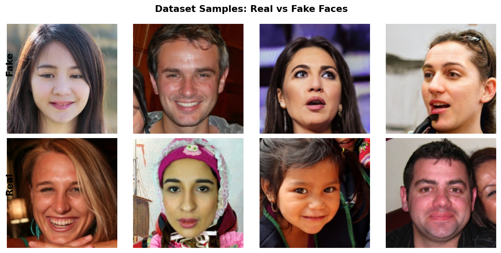
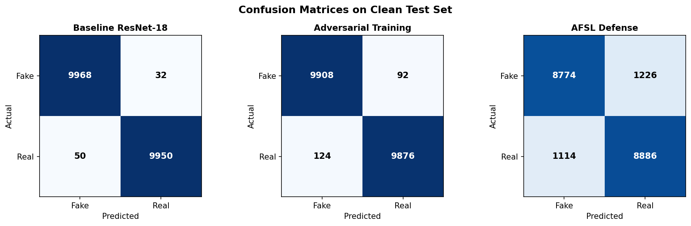
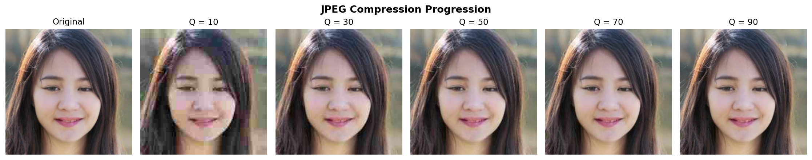
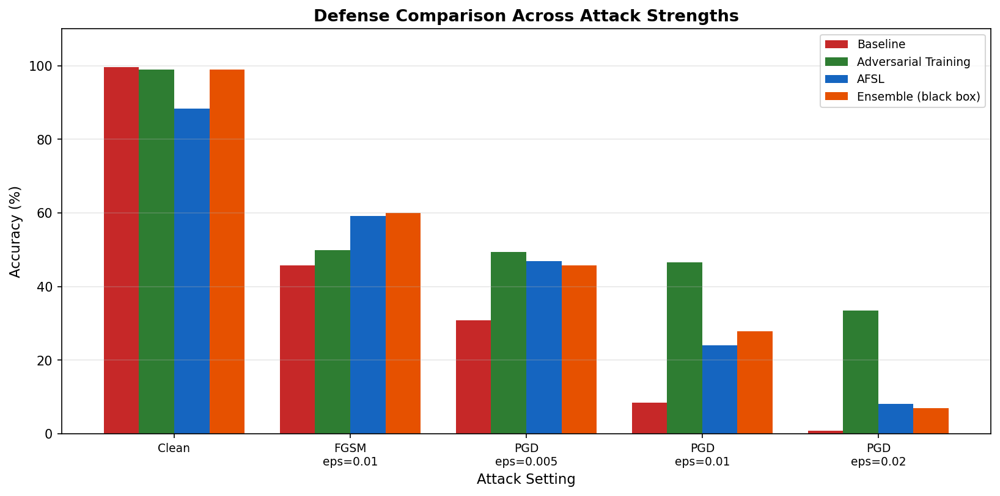
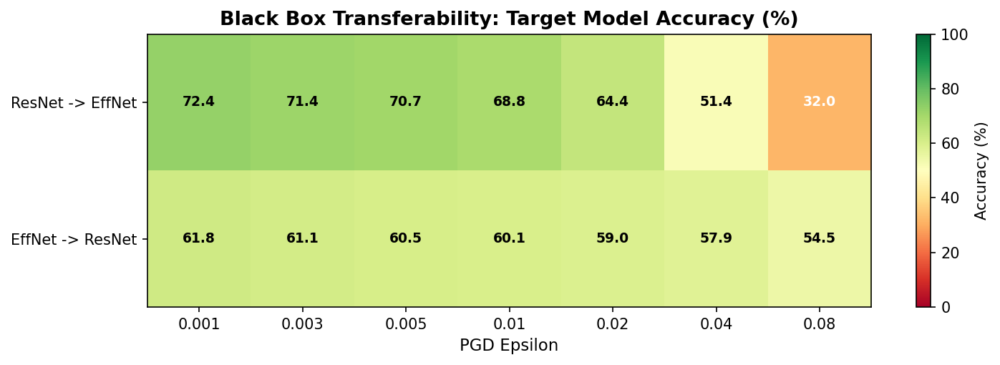

# Deepfake Breakfix

Testing how easily deepfake detectors break under attacks, and whether adversarial training can fix them.

## What is this

Most deepfake detectors do well on clean images but fall apart when you throw real world stuff at them. JPEG compression, noise, blur, resizing. On top of that, adversarial attacks like FGSM and PGD can fool detectors with changes you can't even see. This project tests how bad the damage is and tries to make the detector tougher using adversarial training.

## Project Structure

```
├── configs/default.yaml       # hyperparams and attack sweep ranges
├── docs/                      # setup guide, pipeline docs, architecture diagrams
├── report/                    # IEEE report (LaTeX)
├── results/
│   ├── diagrams/              # architecture and pipeline diagrams
│   ├── plots/                 # degradation curves, comparisons, frequency
│   ├── tables/                # JSON results for all experiments
│   ├── gradcam/               # heatmap outputs
│   └── report/                # figures for the report
├── src/
│   ├── data/                  # dataset, dataloader
│   ├── models/                # model definitions, training, evaluation
│   ├── attacks/               # degradation, adversarial, EOT, C&W, frequency
│   ├── defense/               # adversarial training, AFSL, ensemble
│   └── visualization/         # grad cam, plots
├── slurm/                     # SLURM job scripts for HPC cluster
├── requirements.txt
└── README.md
```

## Pipeline Overview


## Setup

```bash
pip install -r requirements.txt
```

See [docs/setup.md](docs/setup.md) for dataset download and environment setup.

## Dataset

[140k Real and Fake Faces](https://www.kaggle.com/datasets/xhlulu/140k-real-and-fake-faces) from Kaggle.



| Split | Fake | Real | Total |
|-------|------|------|-------|
| Train | 50k | 50k | 100k |
| Valid | 10k | 10k | 20k |
| Test  | 10k | 10k | 20k |

## Results

### Baseline Models



| Model | Clean Accuracy |
|-------|---------------|
| ResNet 18 | 99.56% |
| EfficientNet B0 | 99.88% |

### How badly do they break?

Adversarial attacks on ResNet 18:

| Attack | eps=0.005 | eps=0.01 | eps=0.02 | eps=0.04 | eps=0.08 |
|--------|-----------|----------|----------|----------|----------|
| FGSM | 53.1% | 45.8% | 34.6% | 21.6% | 11.5% |
| PGD | 30.8% | 8.5% | 0.8% | 0.06% | 0.01% |
| C&W (c=1.0) | | | 1.8% | | |

Image degradations:

| Attack | Accuracy |
|--------|----------|
| JPEG Q=10 | 52.0% |
| JPEG Q=50 | 95.9% |
| Noise sigma=0.2 | 88.1% |
| Downscale 8x | 50.0% (random) |
| Blur k=11 | 97.8% |

### JPEG progression



### Do defenses help?



| Defense | Clean | PGD eps=0.01 | FGSM eps=0.08 |
|---------|-------|-------------|---------------|
| No defense | 99.56% | 8.5% | 11.5% |
| Adversarial training | 98.92% | 46.6% | 39.8% |
| AFSL | 88.3% | 24.1% | 19.1% |
| Ensemble (white box) | ~99% | 10.4% | 19.1% |
| Ensemble (black box) | ~99% | 27.9% | |

Adversarial training is the best defense. Big improvement with minimal clean accuracy drop.

### Black box transferability



Attacks crafted for one model partially fool the other. The target model still loses significant accuracy even though the attack wasn't crafted for it.

### Visualization

Grad CAM heatmaps show the baseline focuses on facial features. Under PGD attack, attention becomes diffuse. See [docs/architecture.md](docs/architecture.md) for architecture and pipeline diagrams.

## Docs

- [Setup guide](docs/setup.md)
- [Data pipeline](docs/data-pipeline.md)
- [Baseline model](docs/baseline-model.md)
- [Attacks](docs/attacks.md)
- [Defense](docs/defense.md)
- [Grad CAM and Plots](docs/gradcam.md)
- [Advanced extensions](docs/advanced-extensions.md)
- [Architecture diagrams](docs/architecture.md)

## Running on Cluster (SLURM)

```bash
bash slurm/run_all_overnight.sh    # baseline pipeline
bash slurm/run_all_advanced.sh     # advanced extensions
```

## Progress

- [x] Project setup and data pipeline
- [x] Baseline models: ResNet 18 (99.56%), EfficientNet B0 (99.88%)
- [x] Image degradation attacks (JPEG, noise, blur, downscale)
- [x] Adversarial attacks (FGSM, PGD, C&W, EOT PGD)
- [x] Adversarial training defense
- [x] AFSL defense
- [x] Ensemble defense
- [x] Black box transferability testing
- [x] Frequency domain analysis
- [x] Grad CAM visualization
- [x] Fine grained epsilon sweeps
- [x] IEEE report

## Future Work

- FaceForensics++ integration for cross dataset generalization
- AutoAttack benchmark for certified robustness
- AFSL hyperparameter tuning
- Commercial API testing (AWS Rekognition, Azure)
- Adaptive attacks
- Video level detection

## Tools

Python, PyTorch, OpenCV, torchattacks, pytorch grad cam

## Author

Shivang Patel, PRCV Final Project, Northeastern University
