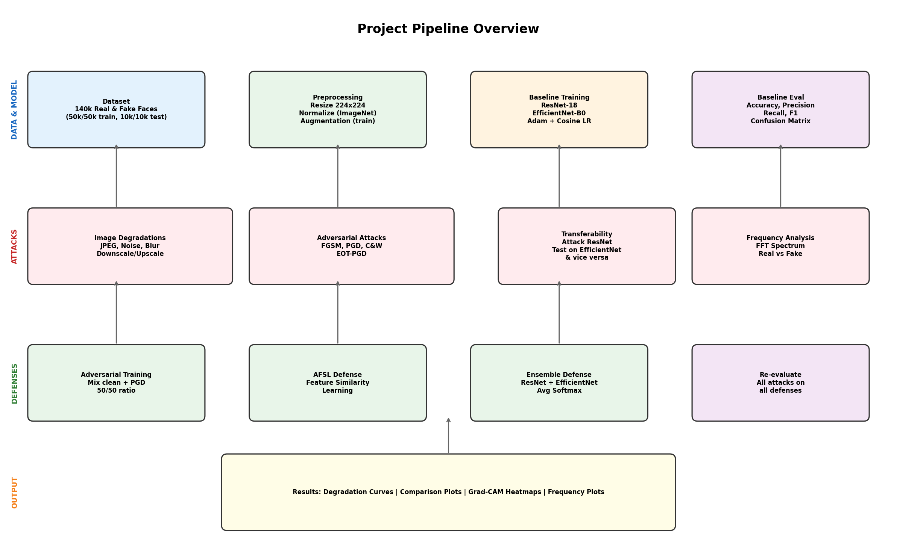
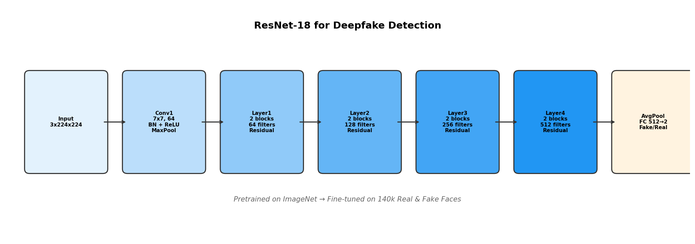
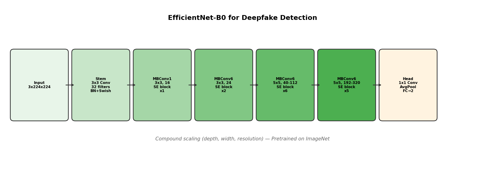
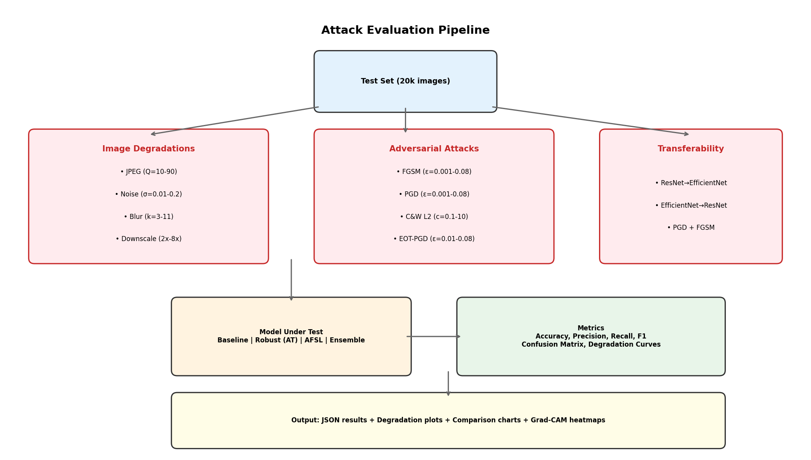
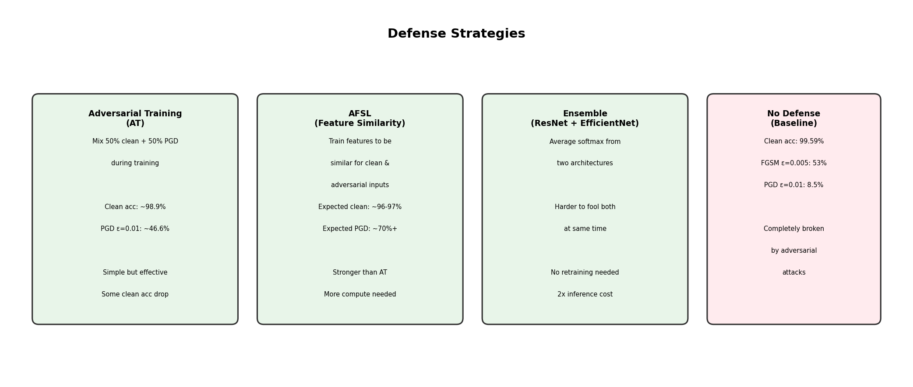

# Architecture & Pipeline Diagrams

All diagrams are in `results/diagrams/`. Regenerate them with:

```bash
python generate_diagrams.py
```

## Pipeline Overview



Shows the full project flow: data → preprocessing → training → attacks → defenses → results.

Four rows:
- **Data & Model**: dataset, preprocessing, baseline training, evaluation
- **Attacks**: degradations (JPEG, noise, blur, downscale), adversarial (FGSM, PGD, C&W, EOT), transferability, frequency analysis
- **Defenses**: adversarial training, AFSL, ensemble
- **Output**: all the plots, tables, heatmaps

## ResNet-18 Architecture



Our primary model. Pretrained on ImageNet, last FC layer swapped from 1000 → 2 classes (fake/real). 4 residual layer groups, each with 2 blocks. Grad-CAM targets Layer4.

## EfficientNet-B0 Architecture



Second model for comparison and ensemble. Uses MBConv blocks with squeeze-and-excitation. Classifier head swapped to 2 classes.

## Attack Pipeline



How we evaluate attacks: test set goes through degradation attacks, adversarial attacks, and transferability tests. Each is tested against every model (baseline, AT, AFSL, ensemble). Metrics collected for every combination.

## Defense Comparison



The three defense strategies side by side with their trade-offs and expected numbers.
