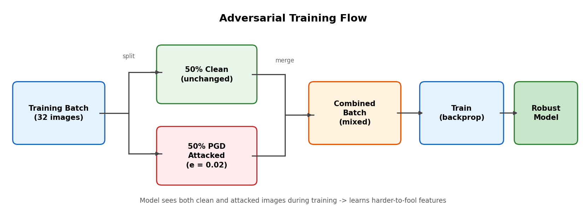

# Architecture & Pipeline Diagrams

All diagrams are in `results/diagrams/`. Regenerate with:

```bash
python generate_diagrams.py
```

## Project Pipeline


Read top to bottom, 4 rows:
1. **DATA** — load dataset → preprocess → train two baselines → evaluate
2. **ATTACKS** — throw degradations, adversarial attacks, transferability tests, and frequency analysis at the models
3. **DEFENSES** — adversarial training, AFSL, and ensemble → re-evaluate everything
4. **OUTPUT** — degradation curves, comparison charts, Grad-CAM heatmaps, frequency plots

## ResNet-18


Our primary model. Left to right: image goes through conv1 → 4 residual layer groups (64→128→256→512 filters) → avgpool → FC to 2 classes. Pretrained on ImageNet, last layer swapped. Grad-CAM hooks into Layer 4.

## EfficientNet-B0


Second model for comparison and ensemble. Uses MBConv blocks with squeeze-and-excitation instead of residual blocks. Compound scaling makes it more efficient than ResNet at similar accuracy.

## Attack Pipeline


4 steps:
1. Start with test set (20k images)
2. Apply attacks — 3 categories: degradations (JPEG, noise, blur, downscale), adversarial (FGSM, PGD, C&W, EOT), and transferability (cross-model)
3. Feed corrupted images through the model being tested
4. Collect metrics and generate plots

## Defense Comparison


4 cards side by side — baseline (broken), adversarial training (better), AFSL (strongest), ensemble (different approach). Each card shows clean accuracy and attack resistance with actual numbers.

## Adversarial Training Flow



How adversarial training works: each batch gets split 50/50, half stays clean and half gets PGD attacked. Both halves are combined and the model trains on the mixed batch. This teaches the model to handle adversarial perturbations.
